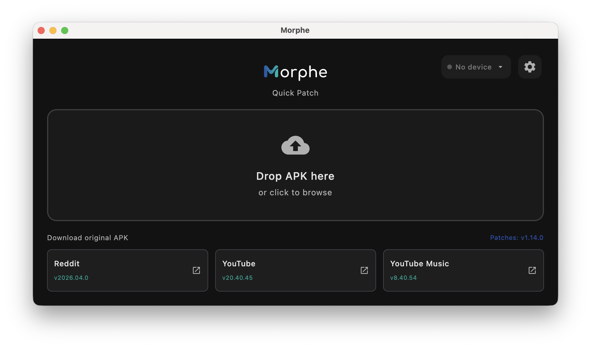
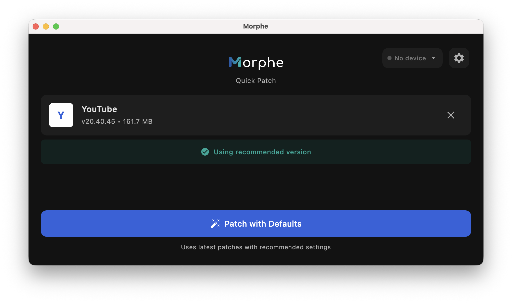
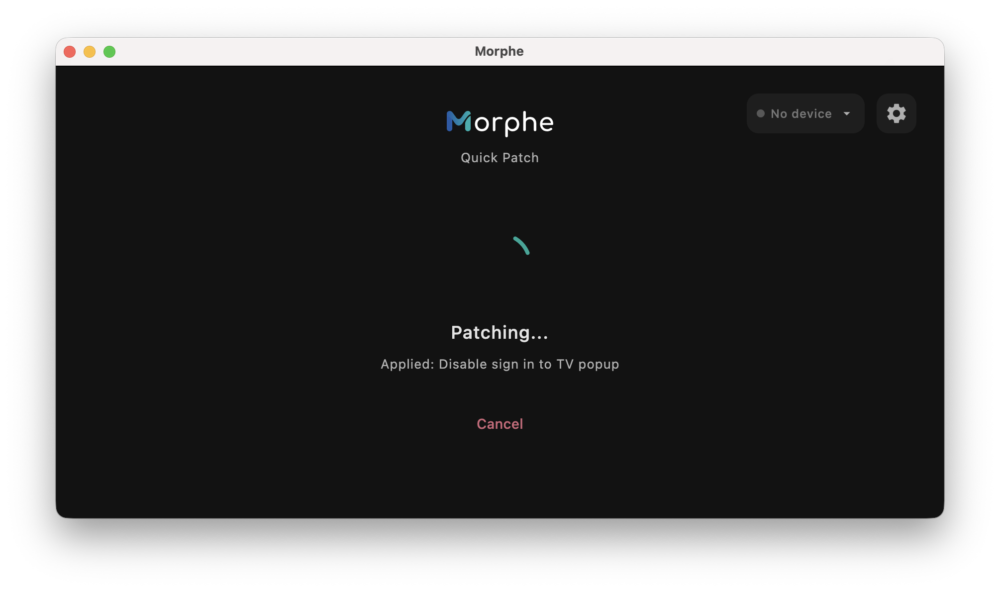
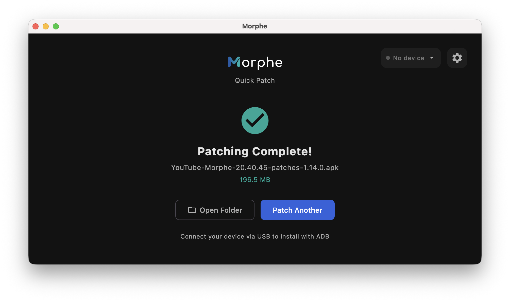

<div align="center"> 
<picture>
    <source
      width="512px"
      media="(prefers-color-scheme: dark)"
      srcset="https://raw.githubusercontent.com/MorpheApp/.github/refs/heads/main/profile/assets/morphe-wordmark/morphe_wordmark_dark.svg"
    />
    
</picture>

[![Website badge](https://img.shields.io/badge/Website-gray.svg?logo=data:image/svg%2bxml;base64,PD94bWwgdmVyc2lvbj0iMS4wIiBlbmNvZGluZz0iVVRGLTgiIHN0YW5kYWxvbmU9Im5vIj8+CjwhLS0gQ29weXJpZ2h0IDIwMjUgTW9ycGhlLiBUaGlzIGlzIGNvcHlyaWdodGVkIGNvbnRlbnQsIGFuZCBub3QgbGljZW5zZWQgdW5kZXIgb3BlbiBzb3VyY2UgdGVybXMuCiAgICAgU2VlIGh0dHBzOi8vZ2l0aHViLmNvbS9Nb3JwaGVBcHAvbW9ycGhlLWJyYW5kaW5nIC0tPgoKPHN2ZwogICB3aWR0aD0iNTEyIgogICBoZWlnaHQ9IjUxMiIKICAgdmlld0JveD0iMCAwIDUxMiA1MTIiCiAgIHZlcnNpb249IjEuMSIKICAgaWQ9InN2ZzIiCiAgIHNvZGlwb2RpOmRvY25hbWU9Im1vcnBoZV9sb2dvX2xpZ2h0LnN2ZyIKICAgaW5rc2NhcGU6dmVyc2lvbj0iMS40LjIgKGViZjBlOTQwZDAsIDIwMjUtMDUtMDgpIgogICB4bWxuczppbmtzY2FwZT0iaHR0cDovL3d3dy5pbmtzY2FwZS5vcmcvbmFtZXNwYWNlcy9pbmtzY2FwZSIKICAgeG1sbnM6c29kaXBvZGk9Imh0dHA6Ly9zb2RpcG9kaS5zb3VyY2Vmb3JnZS5uZXQvRFREL3NvZGlwb2RpLTAuZHRkIgogICB4bWxucz0iaHR0cDovL3d3dy53My5vcmcvMjAwMC9zdmciCiAgIHhtbG5zOnN2Zz0iaHR0cDovL3d3dy53My5vcmcvMjAwMC9zdmciPgogIDxzb2RpcG9kaTpuYW1lZHZpZXcKICAgICBpZD0ibmFtZWR2aWV3MiIKICAgICBwYWdlY29sb3I9IiNmZmZmZmYiCiAgICAgYm9yZGVyY29sb3I9IiMwMDAwMDAiCiAgICAgYm9yZGVyb3BhY2l0eT0iMC4yNSIKICAgICBpbmtzY2FwZTpzaG93cGFnZXNoYWRvdz0iMiIKICAgICBpbmtzY2FwZTpwYWdlb3BhY2l0eT0iMC4wIgogICAgIGlua3NjYXBlOnBhZ2VjaGVja2VyYm9hcmQ9IjAiCiAgICAgaW5rc2NhcGU6ZGVza2NvbG9yPSIjZDFkMWQxIgogICAgIGlua3NjYXBlOnpvb209IjEuMTU0Mjk2OSIKICAgICBpbmtzY2FwZTpjeD0iMjU2IgogICAgIGlua3NjYXBlOmN5PSIyNTYiCiAgICAgaW5rc2NhcGU6d2luZG93LXdpZHRoPSIxNDQwIgogICAgIGlua3NjYXBlOndpbmRvdy1oZWlnaHQ9IjgzNiIKICAgICBpbmtzY2FwZTp3aW5kb3cteD0iMCIKICAgICBpbmtzY2FwZTp3aW5kb3cteT0iMCIKICAgICBpbmtzY2FwZTp3aW5kb3ctbWF4aW1pemVkPSIxIgogICAgIGlua3NjYXBlOmN1cnJlbnQtbGF5ZXI9InN2ZzIiPgogICAgPGlua3NjYXBlOnBhZ2UKICAgICAgIHg9IjAiCiAgICAgICB5PSIwIgogICAgICAgd2lkdGg9IjUxMiIKICAgICAgIGhlaWdodD0iNTEyIgogICAgICAgaWQ9InBhZ2UyIgogICAgICAgbWFyZ2luPSIwIgogICAgICAgYmxlZWQ9IjAiIC8+CiAgPC9zb2RpcG9kaTpuYW1lZHZpZXc+CiAgPGRlZnMKICAgICBpZD0iZGVmczIiIC8+CiAgPCEtLSBMZXR0ZXIgLS0+CiAgPGcKICAgICBpZD0iTGV0dGVyIgogICAgIHN0eWxlPSJmaWxsOiNmZmZmZmY7ZmlsbC1vcGFjaXR5OjEiPgogICAgPHBhdGgKICAgICAgIGlkPSJMZWZ0IgogICAgICAgZD0ibSAxMjMsMTQwIGMgLTIxLDAgLTM5LDE3IC00MCwzOCB2IDE5MiBjIDEsMjEgMTksMzggNDAsMzggMjEsMCAzOSwtMTcgNDAsLTM4IFYgMTc4IGMgLTEsLTIxIC0xOSwtMzggLTQwLC0zOCB6IgogICAgICAgZmlsbD0iIzFFNUFBOCIKICAgICAgIHN0eWxlPSJmaWxsOiNmZmZmZmY7ZmlsbC1vcGFjaXR5OjEiIC8+CiAgICA8cGF0aAogICAgICAgaWQ9IlJpZ2h0IgogICAgICAgZD0ibSAzNDksMjg1IHYgODUgYyAxLDIxIDE5LDM4IDQwLDM4IDIxLDAgMzksLTE3IDQwLC0zOCBWIDE4MiBjIC0xMSwtMTQgLTc0LDYzIC04MCwxMDMgeiIKICAgICAgIGZpbGw9IiMwMEFGQUUiCiAgICAgICBzdHlsZT0iZmlsbDojZmZmZmZmO2ZpbGwtb3BhY2l0eToxIiAvPgogICAgPHBhdGgKICAgICAgIGlkPSJNaWRkbGUiCiAgICAgICBkPSJtIDEyNywxMDggYyAtMzQsMCAtNDQsMjUgLTQ0LDQwIHYgNTQgYyAzMCwtMzMgNzUsMjcgODAsMzMgMjgsMzIgNDQsODcgOTMsODkgNDgsLTIgNjcsLTU2IDkzLC04OSAwLDAgNDUsLTc0IDgwLC04MCAwLC0yOCAtMTEsLTQ3IC00NCwtNDcgLTM0LDAgLTU4LDUwIC03NSw3MiAtMTcsMjIgLTI1LDQ2IC01NCw0NiAtMjksMCAtMzgsLTI1IC01NCwtNDYgLTE3LC0yMiAtNDEsLTcyIC03NSwtNzIgeiIKICAgICAgIGZpbGw9InVybCgjbGluZWFyR3JhZGllbnQyKSIKICAgICAgIHN0eWxlPSJmaWxsOiNmZmZmZmY7ZmlsbC1vcGFjaXR5OjEiIC8+CiAgPC9nPgo8L3N2Zz4K&style=for-the-badge)](https://morphe.software) [](https://github.com/MorpheApp/morphe-documentation#readme) [](https://www.reddit.com/r/MorpheApp) [](https://x.com/MorpheApp) [](https://morphe.software/translate)
<br>
</div>

<h1 align="center">Morphe Desktop</h1>


## About
Morphe Desktop is a command-line and a GUI application that uses [Morphe Patcher](https://github.com/MorpheApp/morphe-patcher) to patch Android apps.

Morphe Desktop's CLI is based on the prior work of [ReVanced](https://github.com/ReVanced/revanced-cli).
The GUI is developed by the Morphe team.
All modifications made by Morphe can be found in the Git history.


## Prerequisites
1. [Required] Java Runtime Environment 11 or above ([Azul Zulu JRE](https://www.azul.com/downloads/?version=java-11-lts&package=jre#zulu) or [OpenJDK](https://jdk.java.net/archive/)).
2. [Required] Morphe Desktop jar file (morphe-desktop-*-all.jar). You can download the most recent stable version of Morphe Desktop from [here](https://github.com/MorpheApp/morphe-cli/releases/latest).
3. [Required] Patches mpp file (patches-*.mpp). You can download the latest stable patch file from [here](https://github.com/MorpheApp/morphe-patches/releases/latest).
4. [Required] Desired app file (app.apk). You can download your apk from [APK Mirror](https://www.apkmirror.com/).
5. [Optional] [Android Debug Bridge (ADB)](https://developer.android.com/studio/command-line/adb) Only if you want to install the patched APK file on your device

## Documentation
Learn how to use Morphe Desktop by following the [documentation](/docs/documentation.md).

## Getting Started
Morphe Desktop is a powerful little application that allows you to patch and install(via ADB) android apps. Although sticking to the suggested apps is recommended, 
you can try and experiment with other apps to your hearts content!

Morphe Desktop runs in two modes:
- CLI: You can run the CLI mode by directly calling it in your preferred terminal.
- GUI: You can run the GUI mode by double-clicking the .jar file. This will open the Morphe Desktop window.

While there are a lot of things that you can do and explore, for the time being in this section, we'll focus on running our first patching and getting a patched apk with the CLI and GUI.

> [!TIP]
> If this your first time using Morphe Desktop, head over to the [GUI](#gui) section instead of [CLI](#cli). 
> Once you get the hang of things, you can start tinkering with the CLI!

### First Run

#### CLI
Following the [prerequisites](#prerequisites) section will get you the two basic but very required files for most patching:
- morphe-desktop-*-all.jar file
- patches-*.mpp

Ideally place both of these files and your desired apk (preferably YouTube for your first run) file in the same folder for now to avoid path headaches.

##### Steps:
1. Open the terminal in the folder you have placed your files. If you are not in that folder, go there by:
    ```
    cd path/to/your/folder
    ```

2. Run the `ls` command if required to check the contents of the folder and confirm that you have all the files over there.

3. Now run the patch command to instruct the morphe-desktop.jar to run the patching process by using the patch command on your apk file like this:
    ```
    java -jar morphe-desktop-*-all.jar patch -p patches-*.mpp your_app.apk
    ```
4. This should start the patching process. You should be able to see a bunch of patches being applied like such:
    ```
    INFO: Loading patches 
    INFO: Decoding app manifest
    INFO: Setting patch options
    INFO: "Override certificate pinning" disabled
    .
    .
    .
    .
    .
    INFO: Aligning APK 
    INFO: Signing APK
    INFO: Saved to /your/path/your_app-patched.apk
    ```

> [!NOTE]
> If you run into any issues or errors, please head over to the [documentation](/docs/documentation.md).


5. You should now have a patched apk with the name of:
    ```
    your_app-patched.apk
    ```
Voilà! This is your final patched apk. Go ahead, install this apk on your device and try it out! 

Now head over to the [documentation](/docs/documentation.md)

#### GUI
Unlike the CLI, the GUI is much user-friendly and straight forward to understand. If this is your first time, the GUI will open in simplified mode/ non-expert mode.


##### Steps:
1. Double-click on the downloaded morphe-desktop-*-all.jar. It should open like this:



2. All you need to do here drag and drop your apk/apkm into the application. Once done, click on the 'Patch' button to begin patching:



3. This should start the patching process and you should be able to see something like this:



> [!NOTE]
> If you run into any issues or errors, please head over to the [documentation](/docs/documentation.md).


4. Once the patching is done, you will see the completed screen. You can now copy the apk over to your device and install it. If you happen to have ADB enabled, you can also directly install it via the application.



Bravo! That should be your first successful patch. If you run into issues or want to tinker around more, please head to the [documentation](docs/documentation.md).


[//]: # (## Everything else)
## Contributing
Thank you for considering contributing to Morphe Desktop.
You can find the contribution guidelines [here](CONTRIBUTING.md).


[//]: # (### Building)

[//]: # (To build Morphe Desktop, you can follow the [documentation]&#40;/docs&#41;.)


## License
Morphe Patches are licensed under the [GNU General Public License v3.0](LICENSE), with additional conditions under GPLv3 Section 7:

- **Name Restriction (7c):** The name **"Morphe"** may not be used for derivative works.  
  Derivatives must adopt a distinct identity unrelated to "Morphe."

See the [LICENSE](LICENSE) file for the full GPLv3 terms and the [NOTICE](NOTICE) file for full conditions of GPLv3 Section 7
